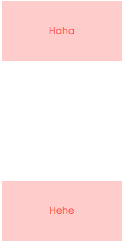

# 关于 BFC (Block Formating Content)

> 摘抄于: <http://www.cnblogs.com/lhb25/p/inside-block-formatting-ontext.html>

## 一、BFC 是什么

在解释 BFC 是什么之前，需要先介绍 Box Formatting Context 的概念。

**Box: CSS 布局的基本单位**

Box 是 CSS 布局的对象和基本单位，直观点来说，就是一个页面是由很多 Box 组成的。元素的类型和 `display` 属性，决定了这个 Box 的类型。不同类型的 Box，会参与不同的 Formatting Context (一个决定如何渲染文档的容器)，因此 Box 内的元素会以不同的方式渲染。让我们看看有哪些盒子：

-   block-level box: `display` 属性为 `block`, `list-item`, `table` 的元素会生成 block-level box。并且参与 block fomatting context；

-   inline-level box: `display` 属性为 `inline`, `inline-block`, `inline-table` 的元素会生成 inline-level box。并且参与 inline formatting context；

-   run-in box: css3 中才有。

**Formatting context**

Formatting context 是 W3C CSS2.1 规范中的一个概念。它是页面中的一块渲染区域，并且有一套渲染规则，它决定了其子元素将如何定位，以及和其他元素的关系和相互作用。最常见的 Formatting context 有 Block fomatting context (BFC) 和 Inline formatting context (IFC)。

CSS2.1 中只有 BFC 和 IFC, CSS3 中还增加了 GFC 和 FFC。

**BFC 定义**

BFC (Block formatting context) 直译为 "块级格式化上下文"。它是一个独立的渲染区域，只有 Block-level box 参与，它规定了内部的 Block-level Box 如何布局，并且与这个区域外部毫不相干。

**BFC布局规则**

-   内部的 Box 会在垂直方向，一个接一个地放置。
-   Box 垂直方向的距离由 `margin` 决定，属于同一个 BFC 的两个相邻 Box 的 margin 会发生重叠。
-   每个元素的 margin box 的左边，与包含块 border box 的左边相接触 (对于从左往右的格式化，否则相反)，即使存在浮动也是如此。
-   BFC 的区域不会与 float box 重叠。
-   BFC 就是页面上的一个隔离的独立容器，容器里面的子元素不会影响到外面的元素，反之亦然。
-   计算 BFC 的高度时，浮动元素也参与计算。

## 二、哪些元素会生成BFC

-   根元素
-   `float` 属性不为 `none`
-   `position` 为 `absolute` 或 `fixed`
-   `display` 为 `inline-block`, `table-cell`, `table-caption`, `flex`, `inline-flex`
-   `overflow` 不为 `visible`

## 三、BFC的作用及原理

1、自适应两栏布局

代码：

```html
  <style>
    body {
      width: 300px;
      position: relative;
    }
    .aside {
      width: 100px;
      height: 150px;
      float: left;
      background: #f66;
    }
    .main {
      height: 200px;
      background: #fcc;
    }
  </style>
<body>
  <div class="aside"></div>
  <div class="main"></div>
</body>
```

页面：


```
每个元素的 margin box 的左边，与包含块 border box 的左边相接触 (对于从左往右的格式化，否则相反)，即使存在浮动也是如此。
```

因此，虽然存在浮动的元素 `aside`，但 `main` 的左边依然会与包含块的左边相接触。

根据 BFC 布局规则第四条：

```
BFC 的区域不会与 float box 重叠。
```

我们可以通过通过触发 `main` 生成 BFC，来实现自适应两栏布局。

```css
.main {
  overflow: hidden;
}
```

当触发 `main` 生成 BFC 后，这个新的 BFC 不会与浮动的 `aside` 重叠，因此会根据包含块的宽度，和 `aside` 的宽度，自动变窄。

效果如下：


2、清除内部浮动

代码：

```html
  <style>
    .par {
      border: 5px solid #fcc;
      width: 300px;
    }
    .child {
      border: 5px solid #f66;
      width:100px;
      height: 100px;
      float: left;
    }
  </style>
<body>
  <div class="par">
    <div class="child"></div>
    <div class="child"></div>
  </div>
</body>
```

页面：


根据 BFC 布局规则第六条：

```
计算 BFC 的高度时，浮动元素也参与计算。
```

为达到清除内部浮动，我们可以触发 `par` 生成 BFC，那么 `par` 在计算高度时，`par` 内部的浮动元素 `child` 也会参与计算。

代码：

.par {
  overflow: hidden;
}

效果如下：


3、防止垂直 `margin` 重叠

代码

```html
  <style>
    p {
      color: #f55;
      background: #fcc;
      width: 200px;
      line-height: 100px;
      text-align:center;
      margin: 100px;
    }
  </style>
<body>
  <p>Haha</p>
  <p>Hehe</p>
</body>
```

页面：


两个 `p` 之间的距离为 `100px` ，发生了 `margin` 重叠。

根据 BFC 布局规则第二条：

```
Box 垂直方向的距离由 `margin` 决定，属于同一个 BFC 的两个相邻 Box 的 `margin` 会发生重叠。
```

我们可以在 `p` 外面包裹一层容器，并触发该容器生成一个 BFC。那么两个 `P` 便不属于同一个 BFC，就不会发生 `margin` 重叠了。

代码：

```html
  <style>
    .wrap {
      overflow: hidden;
    }
    p {
      color: #f55;
      background: #fcc;
      width: 200px;
      line-height: 100px;
      text-align:center;
      margin: 100px;
    }
  </style>
<body>
  <p>Haha</p>
  <div class="wrap">
    <p>Hehe</p>
  </div>
</body>
```

效果如下：



## 四、总结

其实以上的几个例子都体现了 BFC 布局规则第五条：

```
`BFC` 就是页面上的一个隔离的独立容器，容器里面的子元素不会影响到外面的元素。反之也如此。
```

因为 BFC 内部的元素和外部的元素绝对不会互相影响，因此， 当 BFC 外部存在浮动时，它不应该影响 BFC 内部 Box 的布局，BFC 会通过变窄，而不与浮动有重叠。同样的，当 BFC 内部有浮动时，为了不影响外部元素的布局，BFC 计算高度时会包括浮动的高度，避免 `margin` 重叠也是这样的一个道理。


---
