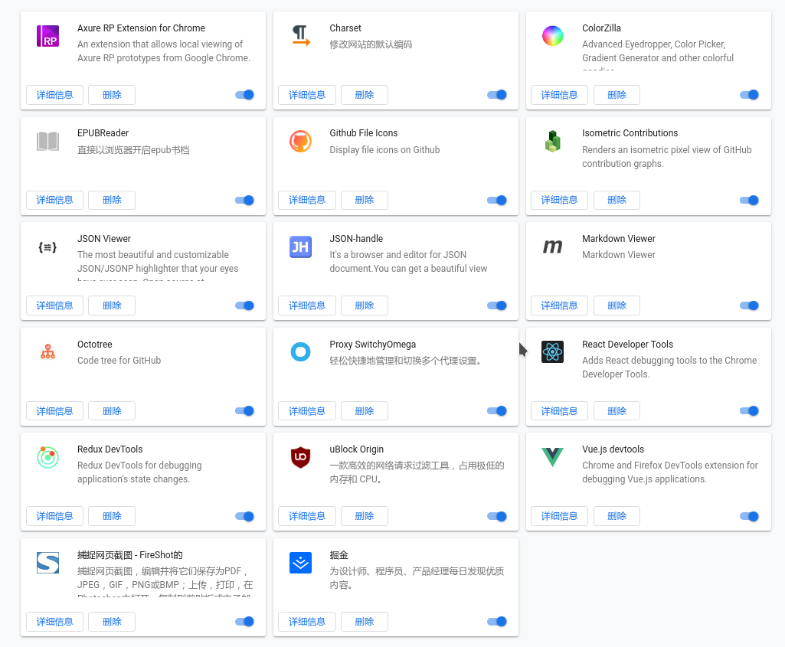

# Chrome 浏览器插件

>

- Axure RP Extension for Chrome (查看原型)
- Charset (设置当前浏览网页的编码符号)
- ColorZilla (网页取色器)
- EPUBReader (Epub 阅读器)
- Github File Icons (GitHub 文件类型 Icon)
- Isometric Contributions (以 3D 像素展示 GitHub 贡献)
- JSON Viewer (页面展示 JSON 格式化数据)
- JSON-handle (处理 JSON 数据)
- Markdown Viewer (查看 Markdown 文档)
- Octotree (展示 GitHub 仓库的目录树)
- Proxy SwitchyOmega (代理设置)
- React Developer Tools (React 调试工具)
- Redux DevTools (Redux 调试工具)
- vue-devtools (Vue 调试工具)
- uBlock Origin (屏蔽广告)
- FireShot (网页截屏)
- 掘金

