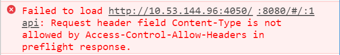

# Misc

> 杂记

## 预检请求报错

-   发起 `Content-Type` 为 `application/json` 的请求：

```javascript
axios({
  headers: {
    'Content-Type': 'application/json',
  },
  method: 'post',
  url: 'api/auth',
  data: { test: true }
})
```

由于 `Content-Type` 为 `application/json`，此时发起的请求为非简单请求，会先触发一个预检请求 (OPTIONS)，正常情况下，后台代码没有设置允许 `Content-Type` 请求头，会出现以下报错：



-   发起自定义请求头为 `X-Authorization` 的请求：

```javascript
axios({
  headers: {
    'Content-Type': 'application/x-www-form-urlencoded',
    'X-Authorization': 'X-Authorization-GHLandy'
  },
  method: 'post',
  url: 'api/auth',
  data: qs.stringify({ test: true })
})
```

由于有自定义请求头，此时发起的请求为非简单请求，会先触发一个预检请求 (OPTIONS)，正常情况下，后台代码没有设置允许的自定义请求头，会出现以下报错：


**！！** 为应对以上情形，需要在后台代码的响应头 `Access-Control-Allow-Headers` 中添加允许的请求头，以 `Express` 为例:

```javascript
res.header('Access-Control-Allow-Headers', 'Content-Type, X-Authorization')
```

> **_扩展阅读_**
>
> **简单请求** 符合一下条件的，称之为简单请求，不会触发预检请求 (OPTIONS)
>
> -   请求方法为
>     -   `GET`
>     -   `HEAD`
>     -   `POST`
> -   请求头为
>     -   `Accept`
>     -   `Accept-Language`
>     -   `Content-Language`
>     -   `Content-Type`
>     -   `DPR`
>     -   `Downlink`
>     -   `Save-Data`
>     -   `Viewport-Width`
>     -   `Width`
> -   请求头 `Content-Type` 的值为：
>     -   `application/x-www-form-urlencoded`
>     -   `multipart/form-data`
>     -   `text/plain`
> -   请求中的任意 `XMLHttpRequestUpload` 对象均没有注册任何事件监听器；`XMLHttpRequestUpload` 对象可以使用 `XMLHttpRequest.upload` 属性访问
> -   请求中没有使用 `ReadableStream` 对象
>
> **非简单请求** 不符符合上述任一条件的，称之为非简单请求，会触发预检请求 (OPTIONS)
>
> 此时，如果后台服务代码中未做相应的设置，则会在预检请求中出现相应的报错，比如以上描述的情形。
