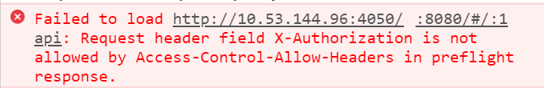
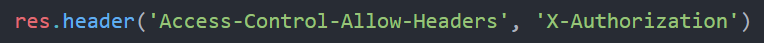

# Misc

## 自定义请求头注意事项

以 `axios` 为例，发起带自定义请求头 `X-Authorization` 的请求：

```javascript
axios({
  header: {
    'X-Authorization': 'X-Authorization-GHLandy'
  },
  method: 'post',
  url: 'api/auth',
  data: { }
})
```

正常情况下，后台代码没有设置允许的自定义请求头，会出现以下报错：



此时需要在后台代码的响应头 `Access-Control-Allow-Headers` 中添加允许的自定义请求头，以 `Express` 为例:



> **_[扩展阅读](https://developer.mozilla.org/en-US/docs/Web/HTTP/Headers/Access-Control-Allow-Headers)_**

> 未做自定义请求头配置前，默认只允许简单请求头：`Accept`、`Accept-Language`、`Content-Language` 和 `Content-Type`,

> 而且 `Content-Type` 的值必须为 `application/x-www-form-urlencoded`、`multipart/form-data` 或 `text/plain`，

> 所以如果前端传数据是以 `Content-Type: application/json` 的形式，我们也会得到这样的报错

> 如果 `Content-Type` 的值不为以上三者之一，则需要在响应头 `Access-Control-Allow-Headers` 配置
